# prueba-practica-arboles-cpp

# Autor
Nombre: Sigcha Arcos Jusatin Israel
Carrera: Software
Tema: Prueba Practica de Arboles
Semestre: Tercero "B"

---


# Sistema Académico con Árbol Binario de Búsqueda (BST)

---

# Introducción

Los árboles binarios de búsqueda son estructuras de datos ampliamente utilizadas en programación debido a su eficiencia para almacenar, organizar y buscar información de manera ordenada. En la asignatura de Estructura de Datos, el estudio de árboles permite comprender cómo gestionar datos jerárquicos aplicando recursividad, punteros y algoritmos de recorrido.

El presente proyecto consiste en el desarrollo de un sistema académico implementado en C++, utilizando un Árbol Binario de Búsqueda (BST) para administrar estudiantes de la Universidad Técnica de Ambato. El sistema permite insertar, buscar, eliminar y recorrer estudiantes almacenados dentro del árbol, además de calcular estadísticas académicas y mostrar información organizada.

---

# Descripción del Proyecto

El proyecto implementa un sistema de gestión de estudiantes mediante un Árbol Binario de Búsqueda, donde cada nodo representa un estudiante y la cédula funciona como clave principal para organizar la estructura del árbol.

El sistema permite realizar operaciones fundamentales sobre árboles binarios, incluyendo recorridos Inorden, Preorden, Postorden y BFS, así como funciones adicionales para calcular altura, contar nodos y clasificar estudiantes según sus notas.

La aplicación fue desarrollada utilizando Programación Orientada a Objetos y estructuras dinámicas en C++.

---

# Objetivo General

Desarrollar un sistema académico utilizando árboles binarios de búsqueda en C++ para gestionar estudiantes y aplicar los conceptos fundamentales de estructuras de datos.

---

# Objetivos Específicos

- Implementar un Árbol Binario de Búsqueda para almacenar estudiantes.
- Aplicar recorridos Inorden, Preorden, Postorden y BFS.
- Implementar operaciones de inserción, búsqueda y eliminación de nodos.
- Calcular la altura y cantidad de nodos del árbol.
- Clasificar estudiantes aprobados y reprobados según sus notas.
- Aplicar programación orientada a objetos y recursividad en C++.

---

# Estructura del Proyecto

```text
PRUEBA-PRACTICA-ARBOLES
│
├── cpp
│   └── main.cpp
│
├── capturas
│
└── README.md
```

---
# Capturas de Ejecución

## Menú Principal

Aquí se muestra la ejecución inicial del sistema y el menú principal con todas las opciones disponibles.

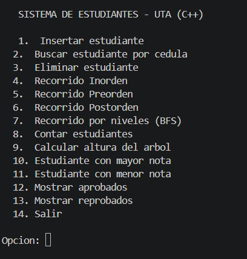

---

## Inserción de Estudiantes

En esta captura se evidencia el ingreso de datos de un estudiante dentro del árbol binario de búsqueda.

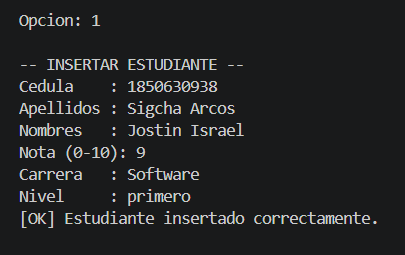

---

## Búsqueda de Estudiante

Aquí se muestra la búsqueda de un estudiante mediante su número de cédula.

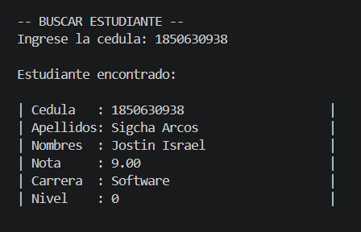

---

## Eliminación de Estudiante

En esta imagen se evidencia la eliminación de un estudiante del árbol.

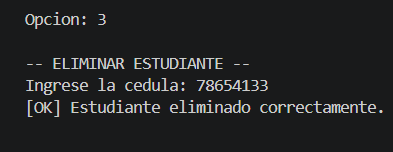

---

## Recorrido Inorden

El recorrido Inorden muestra los estudiantes ordenados ascendentemente por cédula.

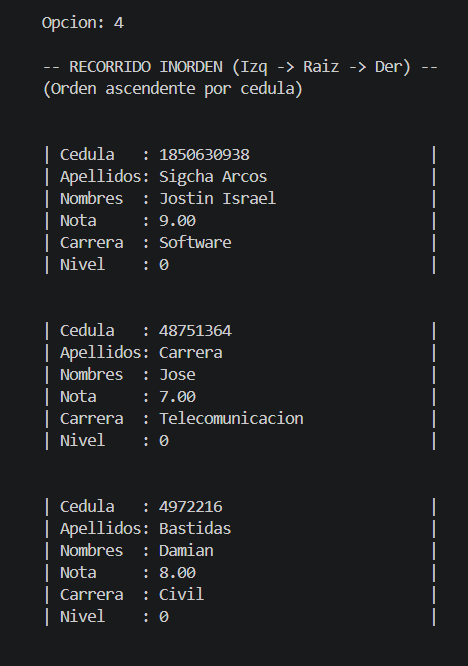


---

## Recorrido Preorden

El recorrido Preorden visita primero la raíz y luego los subárboles izquierdo y derecho.

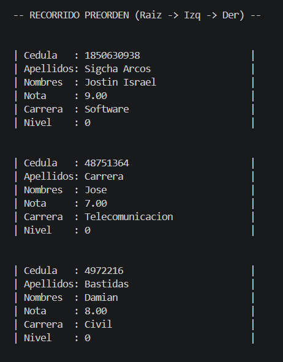

---

## Recorrido Postorden

El recorrido Postorden visita primero los hijos y finalmente la raíz.


---

## Recorrido por Niveles (BFS)

Aquí se evidencia el recorrido BFS utilizando una cola para recorrer el árbol nivel por nivel.

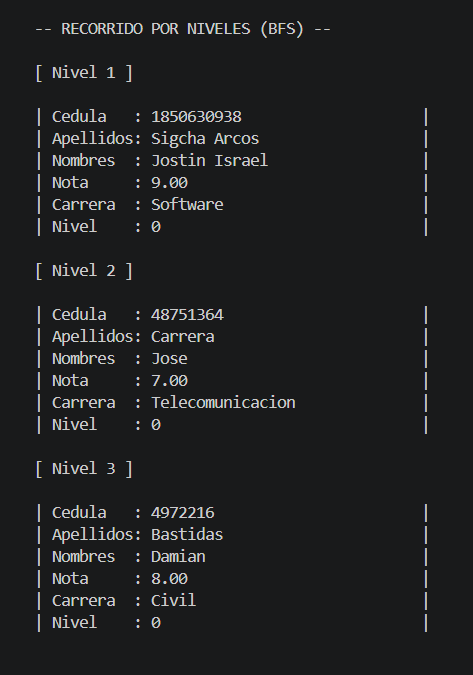

---

## Conteo de Estudiantes

La siguiente captura muestra el total de estudiantes registrados dentro del árbol binario.

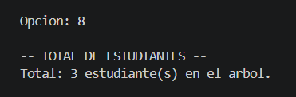

---

## Altura del Árbol

En esta captura se observa el cálculo de la altura del árbol binario de búsqueda.

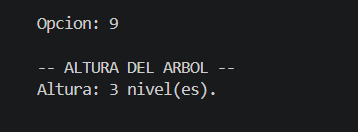

---

## Estudiante con Mayor Nota

Aquí se muestra el estudiante con la calificación más alta registrada.

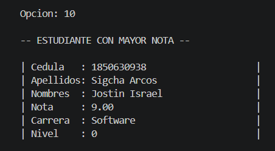

---

## Estudiante con Menor Nota

La siguiente imagen muestra el estudiante con la nota más baja del sistema.

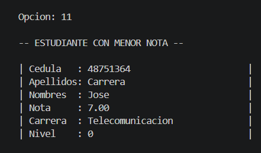

---

## Estudiantes Aprobados

Aquí se visualizan los estudiantes aprobados con nota mayor o igual a 7.

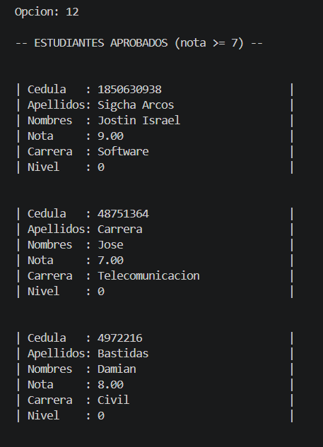

---

## Estudiantes Reprobados

En esta captura se muestran los estudiantes reprobados con nota menor a 7.

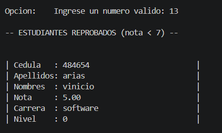

---

# Ejecución del Programa

El sistema fue ejecutado desde Visual Studio Code utilizando la terminal integrada y el compilador de C++ (g++).

Primero se compiló el archivo principal del proyecto mediante el siguiente comando:

```bash id="6o62dl"
g++ main.cpp -o examen
./examen

```

---
# Conclusión

El desarrollo de este proyecto permitió aplicar de manera práctica los conocimientos adquiridos sobre árboles binarios de búsqueda en la asignatura de Estructura de Datos. A través de la implementación del sistema académico en C++, se logró comprender el funcionamiento de estructuras dinámicas, recursividad, manejo de memoria y recorridos de árboles.

Además, se implementaron operaciones fundamentales como inserción, búsqueda, eliminación y recorridos Inorden, Preorden, Postorden y BFS, permitiendo gestionar estudiantes de forma organizada y eficiente dentro del árbol binario.


